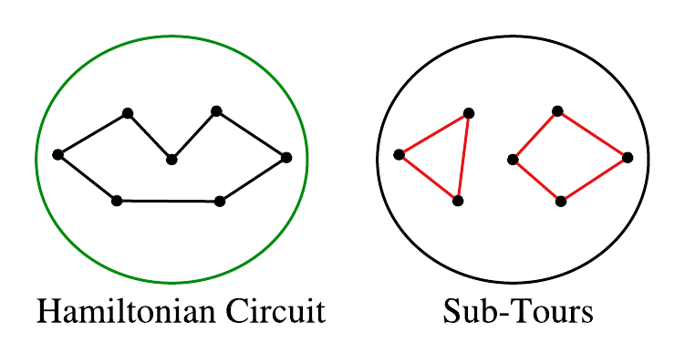

# TSP-Sub-Tour-Elimination-Method
Implementation of the traveling salesman problem and solution based on sub-tour elimination method. Generally, finding the shortest tour around n points using linear optimization techniques.

A detailed description of the project is in 'FileDriver.ipynb' notebook.

# Traveling Salesman Problem (TSP)
## Introduction
> The travelling salesman problem (TSP) seeks to the find the minimum cost hamiltonian circuit in an undirected graph, $G_n$.

> Or more generally, given a list of $n$ cities, finds the fastest way to visit every city once and then return to the first city.
### Problem Formulation
> Let $I$ be a set of $n$ cities

> Then, define an arc $C_{i,j}$ where $i,j\in I$ exists if it is possible to travel from city $i$ to city $j$. And is weighted by the travel time from city $i$ to city $j$.

> Next, let $X_{i,j}$ be a variable such that,
$$ X_{i,j} = \begin{cases}
                1&\text{City $i$ connects to City $j$ is in the hamiltonian circuit}
                \\0&\text{Otherwise}
            \end{cases} $$

> In a traditional TSP, it is possible to travel from any city to any other city, making a $n$ complete graph, $K_n$. $\\$
This means there are $n \choose 2$ total arcs. $\\$
And so there are, 
$$
    |H(K_n)| = \frac{1}{2}(n-1)!
$$ 

>total hamiltonian cycles in $K_n$ $\\$

> This means that a brute force solution runs in exponential time, and is generally NP-Complete.

> This means that the brute force solution has poor scalability, in fact for higher values of $n$ the solution could take years. $\\$
Critically; however, the problem can be cast as a network optimization problem from an adaptation of minimum spanning trees, which is potentially capable of solving the problem much faster.

### Integer Programming Model Local Constraints
> Here we cover the basic formulation for a minimum tour problem.

#### Parameters

> Let $I$ for a list of $n$ cities.

> Let $C_{i,j}$ be the cost of moving from city $i$ to city $j$ (in travel time by road route).

#### Variables :

> Let $X_{i,j}\in\{0,1\}$ be a binary variable determining if arc $C_{i,j}$ is used in the Hamiltonian circuit.
$$ X_{i,j} = \begin{cases}
    1&\text{City $i$ connects to City $j$ is in the hamiltonian circuit}
    \\0&\text{Otherwise}
\end{cases} $$
> Then the goal is to find the least cost way to visit every city starting and returning to city $1$.

#### Objective Function

>Let the cost of any circuit be,
$$
    \min\sum_{i\in I}\sum_{j\in I}C_{i,j}X_{i,j}
$$

#### Local Constraints

> Subject to the constraints,

>> Entering every city only once: 
$$
    \sum_{i \in I}X_{i,j}=1, \quad\quad \forall j\in I
$$

>> Leaving every city only once:
$$
    \sum_{k\in I}X_{j,k}=1, \quad\quad \forall j\in I
$$

>> Don't stay at one city:
$$
    X_{i,i} = 0, \quad\quad \forall i\in I
$$
### Sub Tour Problems
> Unfortunately, the local constraints above are not restrictive enough to eliminate all solutions that do not generate Hamiltonian circuits. In particular, it is still possible to get sub-tours that contribute to the final solution

> Therefore, extra constraints should be added to prevent sub-tours in the final solution.
## Miller-Tucker-Zemlin 1960 (MTZ) Sub-tour Elimination
> One of the best methods to eliminate sub-tours is using the Miller-Tucker-Zemlin (MTZ) approach. Which adds a new time variable $t$, indicating at which point each city is visited in sequence.
#### New Parameter

> First fix some ordering on the list of cities $I$, and let $V = \{1,2,\cdots,n\}$ be that order. So for some $i\in V$, $i = 1,2,\cdots,n$ for $n$ cities. $\\$
Then, for $i\in V$ let $i$ denote either an integer, or a city $i\in I$.

#### Variable

> Next define the time variable, $t_i$ by the time in sequence that city $i$ is visited.

> As a result,
$$
    \text{if } X_{i,j}=1, \quad \text{ then } \quad t_j \geq t_i+1, \quad\quad i,j\neq 1
$$
> This abuses notation a bit, but in general the $i,j$ associated with $X_{i,j}$ are city names. And, the $i,j$ associated with $t_j,t_i$ are integers associated with the ordering on $I$,
> Notice intuitively, this works by restricting a sequence on the order we visit each city. Or rather if we visit cities in the order, $i_1,i_2,\cdots,i_{n-1}$ then,
$$
t_{i_1}=1,t_{i_2}=2,t_{i_3}=3,\cdots,t_{i_{n-1}}=n-1,
$$
> Then, suppose a sub tour exists, such that, $\exists a,b,c\in I$ where $X_{a,b}=X_{b,c}=X_{c,a}=1$ (cycle $C_3$). and none of the cities $a,b,c$ are the originating city. ($a,b,c\neq 1$). $\\$
Then, the time sequence constraints impose,
$$
    \begin{cases}
        t_b \geq t_a+1\\
        t_c \geq t_b+1\\
        t_a \geq t_c+1
    \end{cases}
$$

> Which has no solution. Similar logic can be applied to any sub-tour, ($C_k$), and so this method effectively eliminates sub-tours from the optimal solution.
> Lastly, consider how to encode the 'if' statement, 
$$
    \text{if } X_{i,j}=1, \quad \text{ then } \quad t_j \geq t_i+1, \quad\quad i,j\neq 1
$$

>As a constraint

> In particular, consider,

$$
\begin{cases}
    t_j \geq t_i+1 &X_{i,j}=1\\
    t_j \text{ Unrestricted }& X_{i,j} = 0
\end{cases}
$$
> And so consider the following constraint,
$$
    t_j \geq t_i+1-M(1-X_{i,j})
$$

> For large $M$.
> Actually because it has been shown that there exists an ordering that ensures 
$$
    \max_{i\in V}t_i = n-1
$$

> Then selecting $M=n$ is sufficient to guarantee that an optimal Hamiltonian Circuit can satisfy the constraints.
## Final Problem Formulation

### Parameters

> $I$ be a set of $n$ cities.

> $V$ be an ordering on $I$ such that, $i\in I$ is either an integer $i$, or the $i'th$ city in the ordering of $I$.

> Let $C_{i,j}$ be the cost of moving from city $i$ to city $j$ (in travel time by road route).

### Variables

> Let $X_{i,j}\in \{0,1\}$ be a binary variable if we travel from city $i$ to city $j$ in the tour.
$$ X_{i,j} = \begin{cases}
    1&\text{City $i$ connects to City $j$ is in the hamiltonian circuit}
    \\0&\text{Otherwise}
\end{cases} $$

> Let $t_i$ be the time city $i$ is visited in the tour. For $i\in V$ is an integer.

### Objective Function

>Let the cost of any circuit be,
$$
    \min\sum_{i\in I}\sum_{j\in I}C_{i,j}X_{i,j}
$$

### Local Constraints

>> Entering every city only once: 
$$
    \sum_{i \in I}X_{i,j}=1, \quad\quad \forall j\in I
$$

>> Leaving every city only once:
$$
    \sum_{k\in I}X_{j,k}=1, \quad\quad \forall j\in I
$$

>> Don't stay at one city:
$$
    X_{i,i} = 0, \quad\quad \forall i\in I
$$

### MTZ Constraints

>> Sub-tour elimination
$$
    t_j \geq t_i+1-n(1-X_{i,j}), \quad\quad \forall i,j\in V, \quad j>i
$$

>> Circuit completeness
$$
    t_1 = 1
$$

> The following is a file to run a TSP problem with MTZ constraint solution method. Using default parameters all results are already included in the project package. And so running any portion of the the following is optional.
# Instructions
This file contains automation for running the Traveling Salesman Problem (TSP) program for user selected cities.

Note: this file uses a lot of python dependencies and API's and so is dependent on API keys and package installs.
Importantly, all cells generate a file that is already included in the project folder, and so unless you want to change
the default cities, running every cell is not necessary.

On a high level each section does the following:

    >section: 'city information' >>collects which cities to use for the TSP (you can update this list)

    >section: 'Data Collection' >>converts the list of city information to longitude latitude coordinates,
                                then calculates the travel time between all city pairs. Making a $K_n$ complete
                                graph. (for $n$ cities).
                                Importantly, the length of each arc, $C_{i,j}$ is the travel time from city $i$
                                to city $j$, based on the best estimated road distance between cities.
                                And so cities that do not have feasible driving routes will not be able to 
                                be connected.
                                Data is collected from DistanceMatrix.ai API, https://distancematrix.ai/

    >section: 'AMPL solution' >>first generates a new .dat file using the distance matrix from the previous section.
                                Then, solves the TSP using Miller-Tucker-Zemlin (MTZ) method.
                                The result of which is printed to file 'TSP_MTZ_TOUR_Result.txt'.

    >section: 'Display result' >>uses the file generated from the AMPL solution to print the optimal tour, and display
                                the tour on the US map.